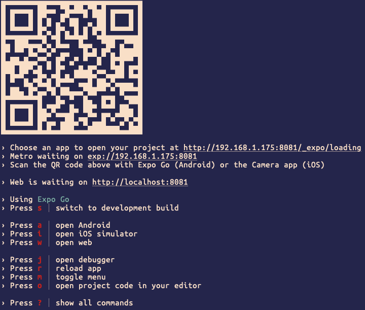
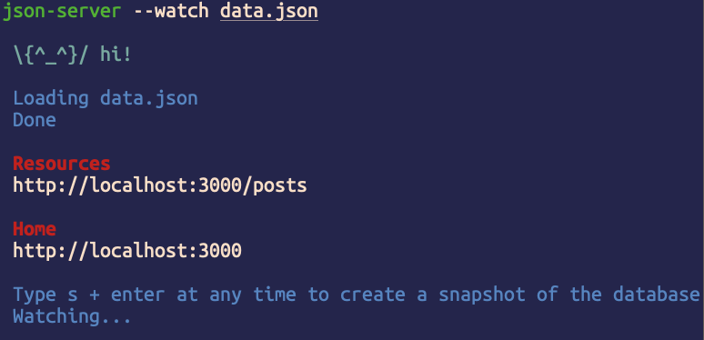
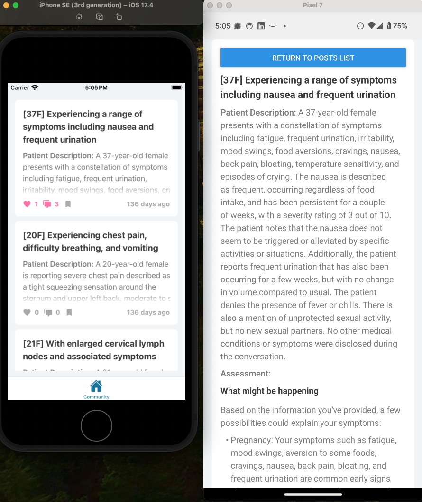
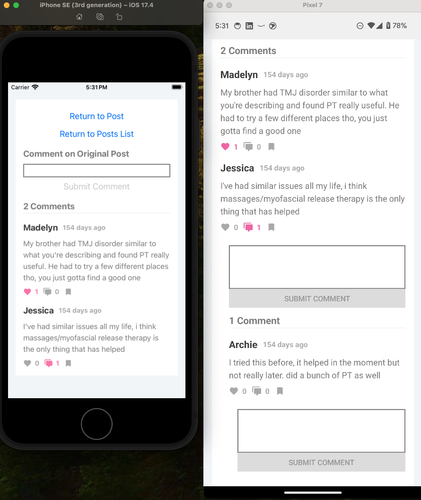

# Welcome to the MDandMe List of Posts Expo app 👋

This is an [Expo](https://expo.dev) project created with [`create-expo-app`](https://www.npmjs.com/package/create-expo-app).

## Get started

1. Install React Native project dependencies

   ```bash
   npm install
   ```

2. Install [json-server] (https://github.com/typicode/json-server/tree/v0) so you can use `data.json` as a database

   ```bash
   npm install -g json-server@0.17.4
   ```

3. Start the back-end json-server

   ```bash
   json-server --watch data.json
   ```

4. Start the app

   ```bash
   npx expo start
   ```

In the output, you'll find options to open the app in a

- [Android emulator](https://docs.expo.dev/workflow/android-studio-emulator/)
- [iOS simulator](https://docs.expo.dev/workflow/ios-simulator/)
- [Expo Go](https://expo.dev/go), a limited sandbox for trying out app development with Expo



5. Make sure that you are running Expo in Expo Go mode, not development mode. As shown in the screenshot above, press `s` to toggle between these two modes.



6. For Android, you will additionally need to run the following command in which you provide the port number (in my case  `3000` as shown in the screenshot above) that your machine's `localhost` connects to when you start the `json-server`:

   ```bash
   adb reverse tcp:3000 tcp:3000
   ```

For more details on why this was necessary, see [this Stack Overflow post](https://stackoverflow.com/a/43277765/8008361).

## If successful, the mobile app should look like the screens below!



